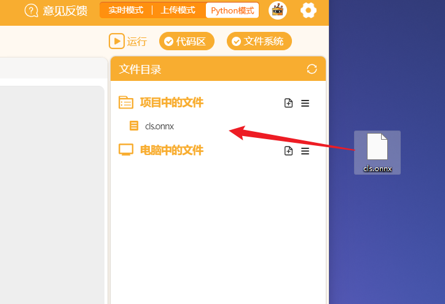

# BaseDeploy


---------------------------------------------------------

## Table of Contents

* [URL](#url)
* [Summary](#summary)
* [Blocks](#blocks)
* [License](#license)
* [Supported targets](#Supportedtargets)

## 链接
* Project URL : ```https://github.com/liliang9693/ext-BaseDeploy```

* Tutorial URL : ```https://mindplus.dfrobot.com.cn/extensions-user```

    

## 简介
使用Mind+V1.7.2及以上版本，在python模式用户库中加载此扩展，AI模型部署工具库。
[BaseDeploy说明1](https://github.com/KerwinKai/XEdu-docs/blob/master/source/basedeploy/introduction.md)  [BaseDeploy说明2](https://xedu.readthedocs.io/zh/master/basedeploy.html)

## 积木列表


## 使用说明
## 1-加载积木库。

- 如果联网情况下，打开Mind+**用户库**粘贴本仓库的链接即可加载： 
  

- 如果电脑未联网，则可以下载本仓库的文件，然后打开Mind+用户库选择**导入用户库**，选择**.mpext**文件即可

  

  

## 2-安装Python库。

打开**库管理**，输入```BaseDeploy```运行，提示```successfully```即可。

> 注：WARNING是提醒，不用管。


## 3-导入模型。

将onnx模型文件拖到**项目中的文件**中。

例如本仓库有一个cls.onnx文件，是一个千分类的物体识别模型。



## 4-推理预测。

编写程序，填写模型名称，将图片传入进行推理，并打印结果。

如下程序是通过opecv打开摄像头，然后循环获取一帧画面，将画面传入模型进行识别，然后打印预测结果


## License

MIT

## 测试情况

MCU                | JavaScript    | Arduino   | MicroPython    | Python 
------------------ | :----------: | :----------: | :---------: | -----
arduino        |             |              |             | 
micro:bit        |             |              |             | 
esp32        |             |              |             | 
unihiker        |             |              |             | 
windows        |             |              |             | √
mac        |             |              |             | 

## 更新日志

* V0.0.1  基础功能完成，未测试
* V0.0.2  修复报错，删除无法使用的积木
* V0.0.3  增加显示文字积木，调整结果下拉列表顺序
